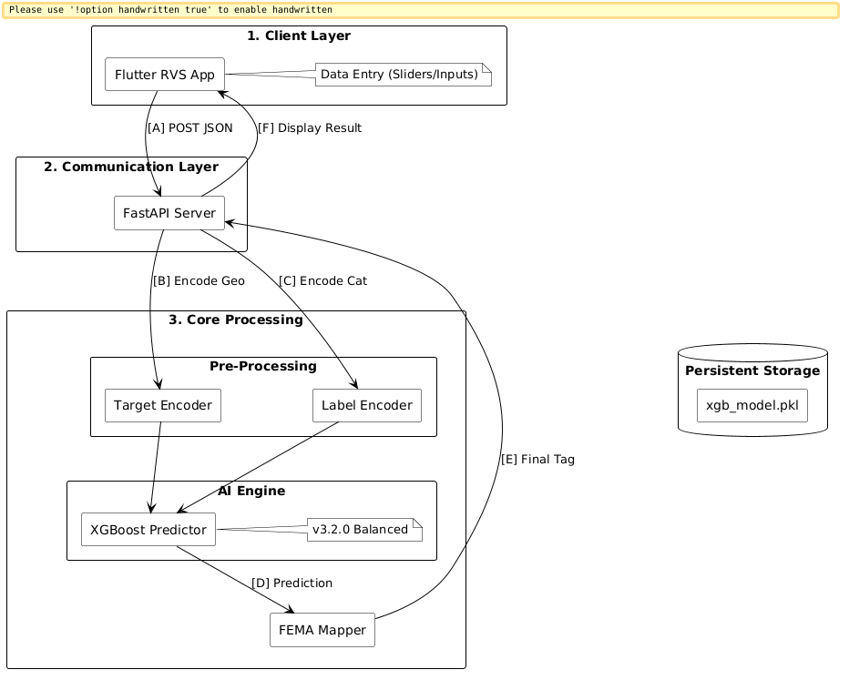

# Rapid Visual Screening (RVS) Seismic Damage Predictor

This project implements a high-performance seismic damage prediction system designed for Rapid Visual Screening (RVS). The tool leverages machine learning to assess building vulnerability and provide FEMA-standard risk ratings based on structural and geographical parameters.

## Overview

Rapid Visual Screening is a methodology used by emergency managers and civil engineers to quickly identify buildings that are potentially hazardous in the event of an earthquake. This application automates that process using an optimized XGBoost classifier trained on historical earthquake data.

## Dataset Source

The model is trained on the "Nepal Earthquake: Case Study on Building Damage" dataset provided by DrivenData.

*   **Competition**: [Nepal Earthquake: Case Study on Building Damage](https://www.drivendata.org/competitions/57/nepal-earthquake)
*   **Data Source**: 2015 Nepal Earthquake structural survey records.

## Core Functionalities

*   **Balanced XGBoost Inference**: A tree-based multiclass classifier optimized for identifying 'Safe', 'Restricted', and 'Unsafe' structural states.
*   **Geo-Target Encoding**: Advanced preprocessing that maps high-cardinality geographical IDs (Region, District, Local) to historical damage means for superior spatial precision.
*   **Real-time Risk Dashboard**: A Flutter-based interactive interface for rapid data entry and instant assessment.
*   **FEMA Protocol Mapping**: Automatic conversion of damage grades into standardized FEMA response tags (SAFE/RESTRICTED/UNSAFE).

## System Architecture

The following diagram illustrates the end-to-end data flow and logical layers of the system.




## Technical Pipeline

1.  **Frontend (Flutter)**: Collects 10 key features including building age, area, height, foundation type, and roof material.
2.  **API (FastAPI)**: Validates input JSON and routes it to the inference pipeline.
3.  **Preprocessing**:
    *   **Label Encoding**: Translates categorical building materials into numeric indices.
    *   **Target Encoding**: Replaces raw Geo IDs with their statistically probable damage impact based on training data.
4.  **Inference**: The XGBoost model (trained with under-sampling to eliminate majority class bias) predicts the damage grade.
5.  **Assessment**: The FEMA Mapper assigns a final safety protocol and UI color code.

## File Structure

*   **/backend**: FastAPI implementation, model training scripts, and serialized artifacts.
*   **/frontend**: Flutter web application and UI logic.
*   **/docs**: System design and architectural documentation.

## Running the Project

### Backend
```bash
cd backend
python app.py
```

### Frontend
```bash
cd frontend/rvs_web
flutter run -d web-server --web-port 8080
```
